# NavAR
NavAR is a Location Based Augmented Reality Android App . It uses the [BeyondAR](https://github.com/BeyondAR/beyondar) framework for AR.

## Features
* Geocoding
* Reverse Geocoding
* Augmented Reality Point of Interest Browser
* Augmented Reality Navigation

## Prerequisite
```
Insert Google Maps API Key at /app/src/release/res/values/google_maps_api.xml
```

## Screenshots

#### Onboarding Screen
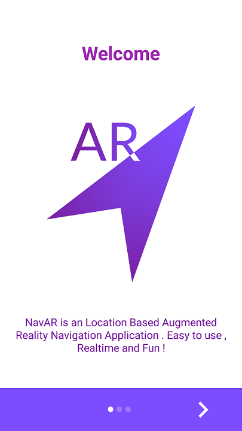 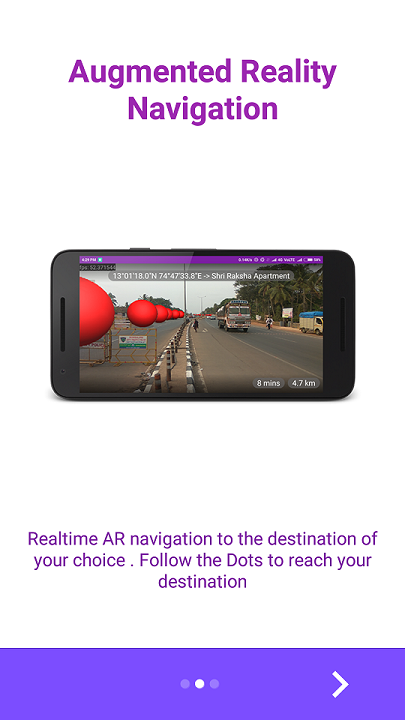 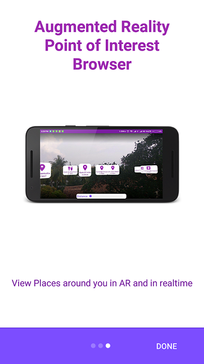

#### Main Screen
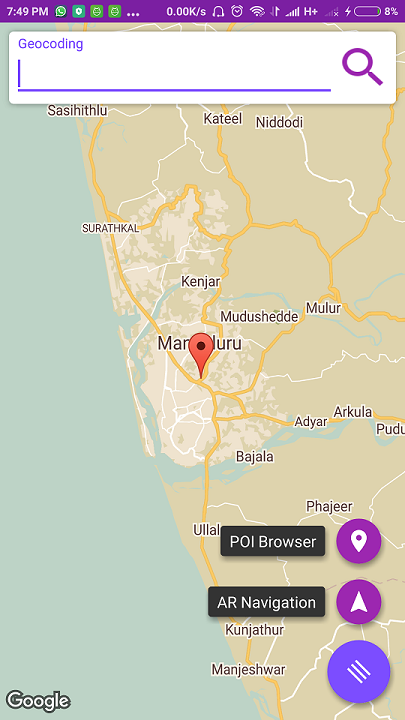 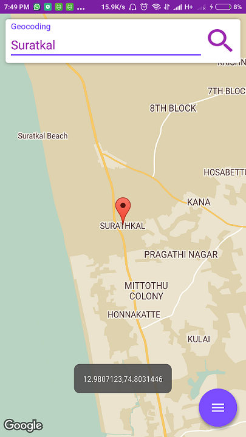 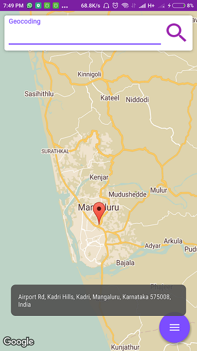 

#### AR Point of Interest Browser
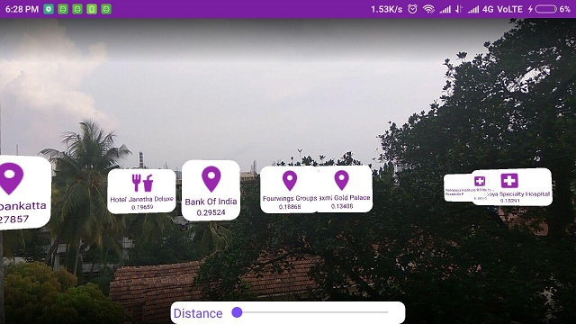 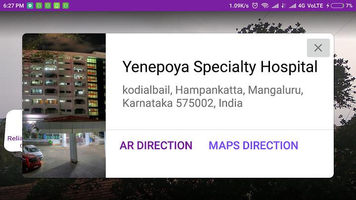 

#### AR Navigation Screen (1/3)
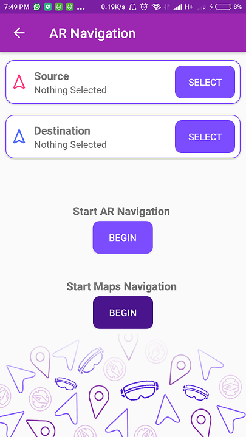 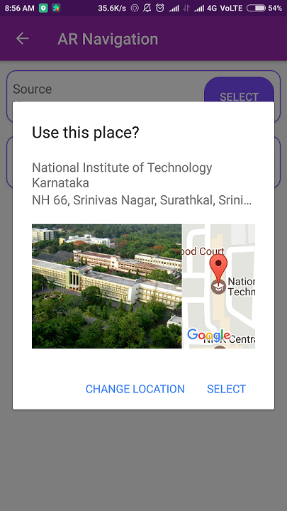  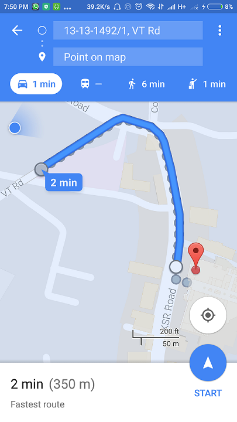 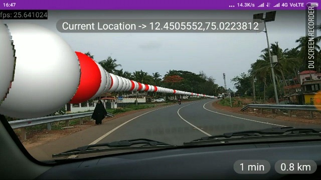

